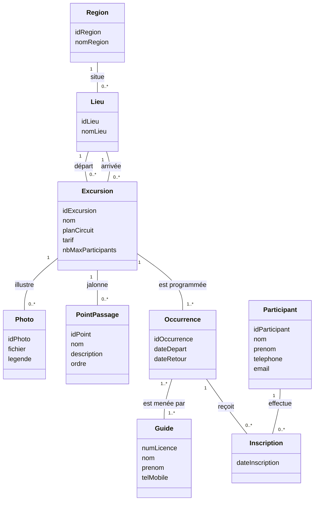
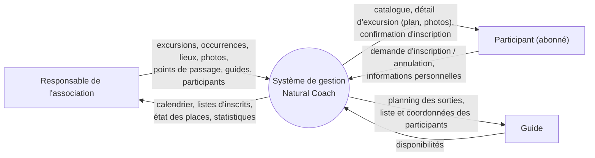
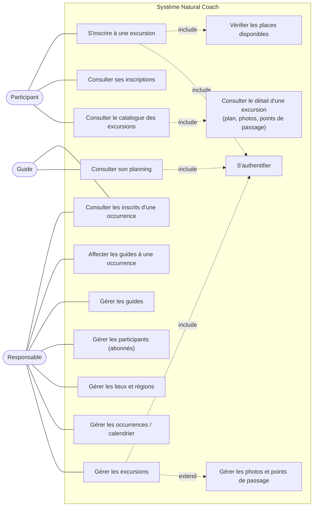

# Natural Coach : modélisation

Association d'excursions et de randonnées au Maroc. Ce dépôt contient la modélisation statique (base de données) et fonctionnelle (contexte et cas d'utilisation) de l'application.

## Contenu du dépôt

| Fichier | Description |
|---|---|
| `README.md` | Modélisation complète (diagrammes et modèle relationnel) |
| `schema.sql` | Script de création de la base (MySQL / MariaDB) |

## Hypothèses de modélisation

- Un **abonné** est un participant : une seule entité `PARTICIPANT`.
- Un **lieu** (point de départ ou d'arrivée) appartient à une région. L'excursion référence deux lieux, d'où deux associations distinctes.
- L'**occurrence** (ou « sortie ») porte les dates. L'excursion reste le produit du catalogue : nom, plan, tarif unique, nombre maximum de participants.
- Les **guides** et les **inscriptions** se rattachent à l'occurrence, pas à l'excursion.
- Les trois variantes sont intégrées : occurrences multiples, photos, points de passage.

## 1. Modélisation statique

### Diagramme de classes



### Contraintes à respecter

- Nombre d'inscrits d'une occurrence ≤ `nbMaxParticipants` de l'excursion.
- `dateRetour` ≥ `dateDepart`.
- Un participant ne peut s'inscrire qu'une seule fois à une même occurrence (clé composée).
- Une occurrence a au moins un guide.

### Modèle relationnel

Convention : `PK` = clé primaire, `#` = clé étrangère.

```
REGION (PK idRegion, nomRegion)

LIEU (PK idLieu, nomLieu, #idRegion)

EXCURSION (PK idExcursion, nom, planCircuit, tarif, nbMaxParticipants,
           #idLieuDepart, #idLieuArrivee)
    idLieuDepart  → LIEU(idLieu)
    idLieuArrivee → LIEU(idLieu)

PHOTO (PK idPhoto, fichier, legende, #idExcursion)

POINT_PASSAGE (PK idPoint, nom, description, ordre, #idExcursion)

OCCURRENCE (PK idOccurrence, dateDepart, dateRetour, #idExcursion)

PARTICIPANT (PK idParticipant, nom, prenom, telephone, email)

GUIDE (PK numLicence, nom, prenom, telMobile)

INSCRIPTION (PK #idOccurrence, PK #idParticipant, dateInscription)

ANIMER (PK #idOccurrence, PK #numLicence)
```

`planCircuit` et `PHOTO.fichier` stockent le chemin ou le nom du fichier, pas le fichier lui-même.

## 2. Modélisation fonctionnelle

### Diagramme de contexte statique



### Diagramme de cas d'utilisation



**Lecture rapide**

- **Participant** : consulte le catalogue et les détails, s'inscrit (après authentification et vérification des places) et consulte ses inscriptions.
- **Responsable** : administre le référentiel (excursions, occurrences, lieux, abonnés, guides) et affecte les guides.
- **Guide** : consulte son planning et la liste des inscrits de ses sorties.
